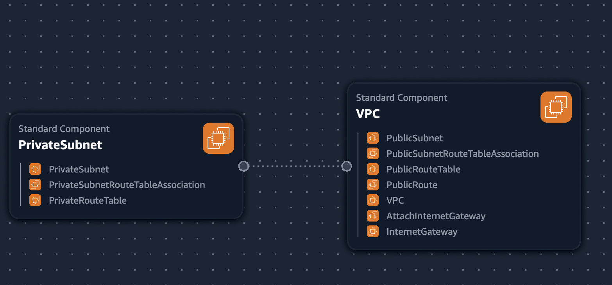
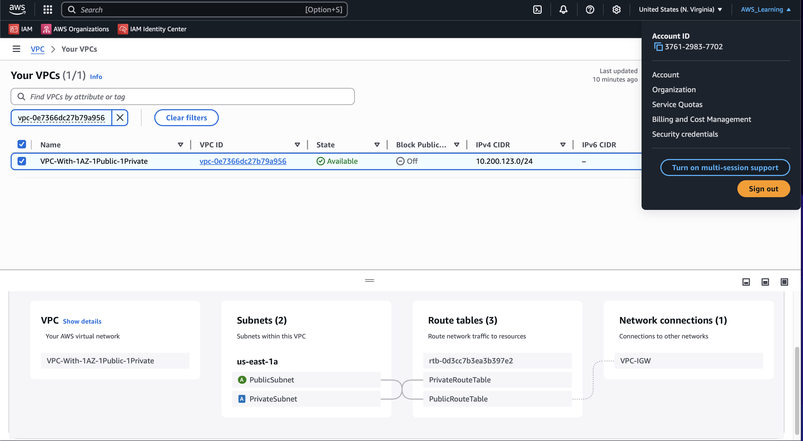

## VPC Settings
These are the VPC Settings we observed Tim setup for our cloud enviroment in AWS:

- VPC IPv4 CIDR Block: 10.200.123.0/24
- Ipv6 CIDR Block: No
- Number of AZs: 1
- Number of private subnets: 1
- Number of public subnets: 1
- NAT GATEWAYS: None
- VPC Endpoints: None
- DNS Options: Enable DNS Hostnames
- DNS options: Enable DNS Resolution

## Generated and Review CFN template

Watching the instructor's video, I noted the VPC Settings, provided this to LLM to produce the CFN template to automate the provision of the VPC infrastructure.

- I had to ask the LLM to refactor the parameters so that it could not hardcode values and the template is more reusable.

## Generated Deploy Script

Using ChatGPT generated a bash script `bin/deploy`.

I changed the shebang to work on all OS platforms.

## Visualization in Infrastructure Composer

Me and the great Andrew Brown thought that maybe we could visualize our network VPC via the Infrastructure composer but its not the best representation.

## Installing AWS CLI 

In order to deploy via the AWS CLI, we need to install it.

We follow the instructions:
https://docs.aws.amazon.com/cli/latest/userguide/getting-started-install.html

## Deployed Resource to AWS

This is the resource map of the VPC deployed with CFN:

